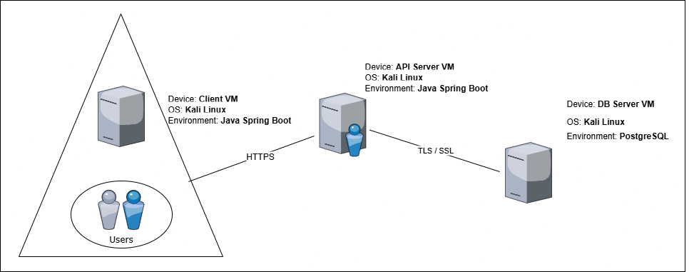

# SecureAccess
SecureAccess is an access control system that allows users to send encrypted access codes for validation through an intermediary server. This application is designed to ensure the security and privacy of communications between users and the server, as well as the integrity of validations made in conjunction with the database server.

#### Secure Document Format Design

Proposed Encrypted Document Structure:
```JSON
{
  "id": 123,
  "access_code": "Base64-Encoded-Secret-Encrypted-Code",
  "timestamp": "Encrypted request date and time (Base64)",
  "secret": "Base64-Encoded-PubKey-Encrypted-Secret",
  "IV": "Base64-Encoded-PubKey-Encrypted-IV",
  "MAC": "Base64-Encoded-MAC"
}
```

The structure of the secure document follows the hybrid encryption model. The secret field represents the symmetric key used to encrypt the message content, which is itself encrypted with the server's public key.
### Protection Needs
The secure document must guarantee the integrity and confidentiality of the data exchanged between the client and the server. Only the legitimate client can submit access requests, and the server can securely validate these requests. It is assumed that the requests are stored on the server. The following security requirements must be ensured:
- [SR1: Confidentiality] Only the server can view the content of the access code sent by the client;
- [SR2: Integrity 1] The server can verify that the message content has not been altered;
- [SR3: Integrity 2] The server can verify whether any access requests are missing;
- [SR4: Authentication] Only the legitimate client can generate valid access requests.

#### Structural Diagram



This proposal delineates a fundamental and secure access control system, wherein communication is safeguarded through robust cryptographic protocols and a firewall configured to ensure the integrity, confidentiality, and authenticity of communications.
